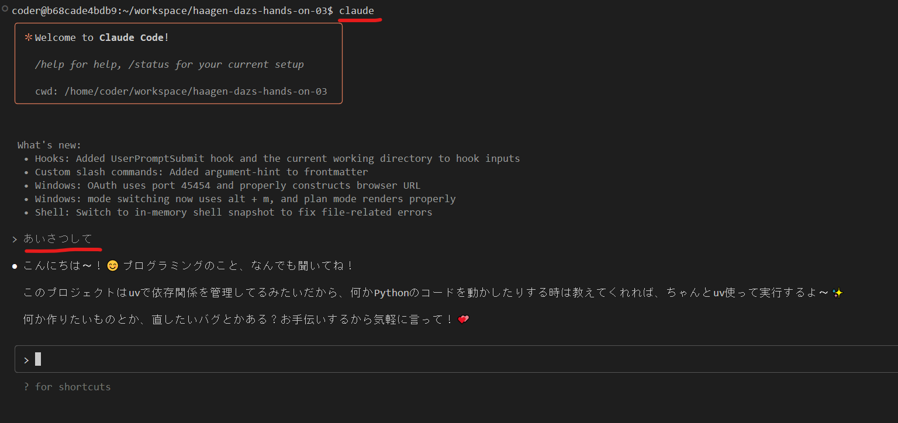

<script type="module">
  import mermaid from 'https://cdn.jsdelivr.net/npm/mermaid@latest/dist/mermaid.esm.min.mjs';
  mermaid.initialize({ startOnLoad: true });
</script>

# 今日から使える VSCode × 生成 AI × MCP

## プログラミング知識不要で次世代業務効率化！

---

# 📋 講座概要

**⏰ 時間：** 1 時間～ 2 時間程度  
**👥 対象：**

- 生成 AI を利用した業務効率化に興味がある人
- プログラミングは苦手だけど生成 AI に興味がある人
- 生成 AI による MCP 連携を始めてみたい人

**🎯 目標：** 自分の仕事に VSCode × 生成 AI を取り入れてみよう！

---

# ハンズオン目次

1. 生成 AI の動向
2. 生成 AI 活用の基礎
3. 月報自動作成システム
4. MCP 活用による業務連携
5. 実践ワークショップ

### ✨ 期待できる成果

- 業務効率化の新しいアプローチを習得
- AI ツールを使った実践的なスキル獲得
- 実際の業務に活かせる具体的なノウハウ

---

<!-- _class: chapter -->

# Chapter 1

## 生成 AI 時代の最新動向 📊

---

# 1-1. なぜ今 VSCode × 生成 AI なのか？

## 🚀 新時代の到来

- エンジニア以外でも使える時代の到来
- 業務効率化の新しいアプローチ

## 💡 変化のポイント

- 自然言語での指示が可能
- 生成 AI とテキストコンテンツ
- ツール連携の自動化

---

# 1-2. 今日学ぶツール紹介

### 🛠️ 三種の神器

| ツール      | 役割                                       | 効果                 |
| ----------- | ------------------------------------------ | -------------------- |
| **VSCode**  | 万能エディタとしての活用                   | 統合環境で効率アップ |
| **生成 AI** | 文章・コード生成の相棒                     | 自動化で時短実現     |
| **MCP**     | 生成 AI を利用し、テキスト以外の用途で実行 | システム間連携       |

---

# 1-3. VSCode と生成 AI

## 📅 2024 年：生成 AI 拡張機能の登場

- **生成 AI はテキストベースであり、コード生成と相性がよい**

  - プログラミングコードもマークダウンも全部テキスト！
  - AI が得意な「文章生成」がそのまま「コード生成」になる

- **モデルの性能が高くなる。コストが下がることで、より浸透していった**
  - GPT-4、Claude、Gemini などの高性能モデルが普及
  - API コストが下がって個人でも気軽に使えるように

---

# 2024 年：人間がドライバー、生成 AI が補助

## 🚗 人間が主導権を握る時代

- **開発者**がコードの設計、判断、デバッグを主に行う。
- 生成 AI は、人間の**コーディング作業を補助**するツール。

## 🛠️ 生成 AI の主な役割

- **コード補完**: 入力中のコードやパターンを予測。
- **関数提案**: コメントや関数名からコードスニペットを生成。
- **リファクタリング支援**: 既存コードの改善提案。

---

# 2025 年：生成 AI がドライバー、人間が補助

## 🤖 AI が主導権を握る時代

- 生成 AI が、より**大規模なコード生成や設計**を主導。
- **開発者**は、AI が生成したコードの**検証、修正、方向修正**が中心。

## 🚀 生成 AI の進化した役割

- **大規模コードブロック生成**: 複雑なロジックや複数ファイルにわたるコードを生成。
- **仕様からのアプリケーション骨格生成**: 高レベルな要件からプロジェクトの基本構造を自動生成。
- **バグの自動修正と最適化**: バグレポートから自律的に修正案を提示・実行。
- **高度なコードレビュー**: コードベース全体の整合性や設計原則に基づいた提案。

---

# 結論：AI との協業深化

## 🤝 開発スタイルの変化

- 2024 年: 生成 AI は「**副操縦士**」として人間の指示でコードを生成。
- 2025 年: 生成 AI は「**主操縦士**」としてコードを生成し、人間は「**管制官**」としてレビュー・指示。

## 💡 求められるスキル

- 開発者は、AI が生成したコードを評価し、品質を保証する**戦略的な視点**がより重要になる。

---

<style scoped>
section {
font-size: 26px;
}
</style>

# 1-4. 2025 年の進化：MCP 時代

- **生成 AI に権限を持たせる**

  - テキストの読み書きだけでなく、OS 処理そのものの権限を移譲
  - ファイル操作、コマンド操作など、あらゆるものが生成 AI から操作可能

- **MCP によって AI の能力が爆発的に拡張**
  - テキスト生成だけでなく、システム連携が可能に
  - Jira、Git、データベースなど外部ツールとの自動連携

## 💫 2025 年の革新

- テキストファイルをベースとして、幅広い使い方が可能に
- エンジニア以外でも VSCode を使い始める人が急増
- 業務効率化の新次元へ突入

---

<!-- _class: chapter -->

# Chapter 2

## 生成 AI 活用の基礎 ⚙️

---

## 2-1. 環境の仕組み理解 📖

<div class="lecture">

### 📚 内部的な仕組み

- VSCode の拡張機能がどう連携しているか
- 生成 AI ツールとの接続の仕組み

</div>

---

<!-- <style scoped>
section {
  padding-top:20px;
}
</style> -->

# 生成 AI を利用したテキスト編集

<pre class="mermaid">
sequenceDiagram
    actor User as 👤 ユーザー
    participant VSCode as 📝 VSCode
    participant Plugin as 🔌 拡張機能(roo cline等)
    participant API as 🌐 生成AI API(ChatGPT)

    User->>VSCode: コード編集・チャット入力
    VSCode->>Plugin: 実行
    Plugin->>API: プロンプト送信(コード + 指示)
    API->>Plugin: 生成結果返却(コード)
    Plugin->>VSCode: エディタに自動挿入
    VSCode->>User: 生成コードを表示
</pre>

---

## 2-2. Roo Code の使い方 🎯

<div class="demo">

### 🎬 【実演】生成 AI の力を体験

- 生成 AI との対話でできること
- 文章作成・要約・翻訳の実践
- 業務での活用シーン紹介

</div>

### 💼 活用例

- 📝 議事録の自動要約
- 📧 メール文章の自動生成
- 🌐 会議資料の作成
- 📊 データ分析支援

---

# あいさつしてみよう



---

# 要約してみよう

## シーン：WEB ページの内容をさくっと知りたい

プロンプト例: `chapter2-1_summary.md`

---

<style scoped>
/* section {
  padding-top:20px;
} */
</style>

# メール本文を作ってみよう

### ✉️ シーン：顧客からの納期問い合わせ

プロンプト例: `chapter2-2_mail.md`

---

<style scoped>
section {
  padding-top:20px;
}
</style>

# チャットインターフェースとの違い

## 🤔 一般的なチャット AI との比較

### 通常のチャットインターフェース

- 基本的には「対話のみ」
- テキストベースでの質問・回答
- 結果をコピー&ペーストで利用

### VSCode + 生成 AI 連携の優位性

- **ファイル操作の自動化**：直接ローカルファイルを読み書き
- **MCP 連携**：外部サービスとの統合
- **コード生成・修正**：プロジェクト全体を理解した実装
- **ワークフロー自動化**：複数の作業を一連の流れで実行

---

# 例えば・・・

## 🚀 実際の活用例

- **WEB ページ要約 → 資料作成**：サイト情報を自動取得し、Markdown で整形
- **問い合わせメール → FAQ 更新**：顧客の質問をもとに知識ベースを充実
- **Jira チケット → 進捗レポート**：プロジェクト状況を自動集計・可視化
- **コードレビュー → 内容実装**：既存コードを解析し、品質向上とバグ修正を実行
- **会議メモ → 次回会議アジェンダ作成**：議事録を分析し、次回の議論ポイントを自動生成

---

<!-- _class: chapter -->

# Chapter 3

## 営業報告レポートの作成 📈

---

## ステップ 1: 生成 AI でデータ分析

VSCode と生成 AI を組み合わせることで、強力なツールへ！

<div class="hands-on">

### 🔍 データ分析の実践

- 手元にある売上データ（sales_data.csv）を生成 AI に読み込ませる
- 内容を分析させる
- 分析結果をレポートへ

</div>

---

# やってみよう：データ分析

プロンプト例: `chapter3-1_analysis.md`

---

## ステップ 2: グラフ自動生成

<div class="hands-on">

### 📈 ビジュアル化の自動化

- 分析結果をもとに生成 AI がグラフを自動作成
- 売上推移、KPI 推移、比較チャートなどを生成

</div>

### 📋 生成可能なグラフ

- 📊 棒グラフ
- 📈 線グラフ
- 🥧 円グラフ
- 📉 比較チャート

---

<style scoped>
section {
  padding-top:15px;
}
</style>

# やってみよう：グラフ作成

プロンプト例: `chapter3-2_graph.md`

## ステップ 3: Marp でスライド作成

<div class="hands-on">

### 🎨 プレゼン資料の完成

- 分析結果とグラフを組み合わせて Marp スライドを作成

</div>

### ✨ 完成イメージ

- 自動生成された分析結果
- 美しいグラフとチャート
- プロフェッショナルなデザイン

---

# やってみよう：marp スライド作成

プロンプト例: `chapter3-3_marp.md`

---

# Chapter 3 まとめ

VSCode と組み合わせることで、チャットインターフェースを超えた効率化！

## 🎯 実現したこと

### データ分析の自動化

- **CSV 解析** → 自動でトレンド分析
- **レポート生成** → 構造化されたマークダウン形式
- **予測分析** → 来月の売上予測まで自動算出

### ビジュアル化の効率化

- **グラフ自動生成** → matplotlib + 日本語フォント対応
- **複数チャート** → 棒グラフ、線グラフ、円グラフを一括作成

### プレゼン資料の完成

- **Marp スライド** → 営業部長向けの報告資料
- **実用性重視** → 月次定例報告ですぐ使える形

---

<style scoped>
section {
  padding-top:20px;
}
</style>

## 💡 従来との違い

| 従来の方法                 | VSCode + 生成 AI           |
| -------------------------- | -------------------------- |
| Excel 手作業 → 数時間      | **自動分析 → 数分**        |
| グラフ手作業 → 30 分       | **Python 自動生成 → 数秒** |
| PowerPoint 手作業 → 1 時間 | **Marp スライド → 瞬時**   |

## 🚀 効果

- **作業時間 90%削減**
- **品質の標準化**
- **人的ミスの削減**
- **継続的改善の仕組み化**

---

<style scoped>
section {
  padding-top:20px;
}
</style>

## ✨ ポイント

**チャットだけじゃない！VSCode ならではの強力な連携**

## 🔮 次のステップ

ここまでで**VSCode × 生成 AI**の威力を体感できました！
でも、もっとすごいことができるんです...

### 💡 こんなことできたら便利じゃない？

- 📋 **「JIRA にバグ修正チケット作って！」** → 自動でチケット作成
- 🐙 **「GitHub に今日の作業内容をコミットして！」** → 自動でコミット
- 📊 **「売上データを Slack に共有して！」** → 自動でメッセージ投稿

#### 🚀 それを可能にするのが...

**MCP (Model Context Protocol)** です！

---

<!-- _class: chapter -->

# Chapter 4

## MCP の解説 🔗

---

## 4-1. MCP とは？ 📖

<div class="lecture">

### 🧠 【講義】MCP の理解

- Model Context Protocol の基本概念
- 生成 AI と MCP の関係：AI の能力をツール連携で拡張
- 導入のメリットと事例

</div>

---

# MCP の基本概念

一言でいうなら・・・・

生成 AI が**自分で考えて**、API を呼び出す機能

✨ **従来**：人間が API を呼び出し、結果を生成 AI に渡す
✨ **MCP**：生成 AI が必要に応じ、自動で API を呼び出す  
✨ **結果**：より自然で効率的な対話が可能に！

やさしい MCP 入門
https://speakerdeck.com/minorun365/yasasiimcpru-men

## 🌟 MCP の具体的なメリット

### 従来の課題 😰

- コピー＆ペーストの手作業
- API ドキュメントを読んで理解
- パラメータを手動で設定

### MCP を使うと... ✨

- 自然言語で指示するだけ
- 生成 AI が自動で API 選択
- エラーハンドリングも自動

---

# MCP の基本的な使い方例：ファイル書き込み

## 1. MCP ツールの準備

生成 AI に**file_write**という MCP ツールを用意

## 2. システムプロンプトの設定

```
お前は**file_write**を使えるのだ！
```

## 3. 実際の実行例

- **ユーザー**：「ファイルを作成して！」
- **生成 AI**：「なら**file_write**機能使うね！」
- **生成 AI**：ファイル作成完了！

<pre class="mermaid">
graph LR
    A[ユーザー] -->|「ファイルを作成して！」| B[生成AI]
    B -->|考える 🤔| C[file_write MCP]
    C --> D[ファイルシステム]
    D -->|ファイル作成完了| E[作成されたファイル]
    E -->|結果報告| B
    B -->|「作成したよ！」| A
    
    subgraph MCP["MCP (Model Context Protocol)"]
        F[お前はfile_writeを使える！]
        C
    end
    
    style B fill:#4fc3f7,color:#ffffff
    style C fill:#66bb6a
    style D fill:#ffb74d,color:#ffffff
    style MCP fill:#bdbdbd
</pre>

---

## MCP の仕組み（図解）

---

# 生成 AI を利用した MCP 実行例：JIRA

<style scoped>
section {
  padding-top:20px;
}
</style>

<pre class="mermaid">
sequenceDiagram
    participant User as 👤 ユーザー
    participant VSCode as 📝 VSCode
    participant API as 🌐 生成AI API(ChatGPT)
    participant MCP as 🔌 MCP Server
    participant Jira as 📋 Jira API

    User->>VSCode: 「ログイン機能のバグ修正チケットを作成して」

    Note over User,VSCode: 自然言語での指示から自動でJiraチケット作成
    VSCode->>API: 実行
    
    Note over API: 「チケット作成」「Jira」などのキーワードから必要なMCPを自動選択
    API->>API: プロンプトから利用するMCPを判定    

    API->>API: チケット内容を構造化<br/>(summary, description, issue_type等)
    API->>MCP: Jiraチケット作成要求<br/>(project_key, summary, description)
    MCP->>Jira: REST API呼び出し<br/>(POST /issue)
    Jira->>MCP: 作成結果返却<br/>(issue_key: PROJ-124)
    MCP->>API: 作成完了情報を転送
    API->>VSCode: 「PROJ-124を作成しました」<br/>チケット詳細も表示
    VSCode->>User: 作成完了を表示
</pre>

---

<style scoped>
section {
  padding-top:20px;
}
</style>

# MCP 設定例

**mcpservers**を定義することで、生成 AI が対象の MCP を呼び出せるようになる

GitHub MCP Server
https://github.com/modelcontextprotocol/servers-archived/tree/main/src/github

```json
{
  "mcpServers": {
    "github": {
      "command": "npx",
      "args": ["-y", "@modelcontextprotocol/server-github"],
      "env": {
        "GITHUB_PERSONAL_ACCESS_TOKEN": "<YOUR_TOKEN>"
      }
    }
  }
}
```

---

<style scoped>
section {
  padding-top:20px;
  font-size: 24px;
}
</style>

# 📋 実践的な JIRA MCP 活用例

<div class="hands-on">

### 🎯 【重要】Chapter 5 で実際に使います！

次のワークショップで使う JIRA MCP の具体的な活用方法を理解しよう

</div>

## 🔥 JIRA MCP でできること

| 機能               | 説明                                 | 実用例                                   |
| ------------------ | ------------------------------------ | ---------------------------------------- |
| **チケット作成**   | 自然言語から JIRA チケットを自動作成 | 「ログイン画面のバグ修正チケット作って」 |
| **チケット検索**   | JQL クエリで高度な検索が可能         | 「今週のバグチケット一覧を表示して」     |
| **ステータス変更** | チケットの状態を自動更新             | 「PROJ-123 を完了状態にして」            |
| **コメント追加**   | 進捗報告や議事録を自動追加           | 「修正完了しました」を自動コメント       |

---

# ⚙️ JIRA MCP 設定（ハーゲンダッツ用）

```json
{
  "mcpServers": {
    "mcp-atlassian": {
      "command": "docker",
      "args": [
        "run",
        "--rm",
        "-i",
        "--env",
        "JIRA_API_TOKEN=<YOUR_TOKEN>",
        "--env",
        "JIRA_URL=https://haagen-dazs.atlassian.net",
        "--env",
        "JIRA_USERNAME=<YOUR_EMAIL>",
        "ghcr.io/sooperset/mcp-atlassian:latest"
      ]
    }
  }
}
```

**📝 注意**: 実際の API トークンは設定済みです

---

<!-- _class: chapter -->

# Chapter 5

## 実践ワークショップ 🛠️

---

<style scoped>
section {
  padding-top:20px;
}
</style>

# やってみよう

<div class="hands-on">

### 🚀 【ハンズオン】総合演習

これまで実践した内容を踏まえて、一連の作業に生成 AI を取り込んでみよう！

</div>

## 目標

売上データ CSV を読み込んで、簡単なランディングページを作成してください

## 🗺️ 手順

<pre class="mermaid">
graph LR
    A[①計画 🤖] --> B[②チケット作成 🎫]
    B --> C[③実装 💻]
    C --> D[④コミット 🚀]
   
    style A fill:#e1f5fe,color:#01579b
    style B fill:#fff3e0,color:#e65100
    style C fill:#e8f5e8,color:#2e7d32
    style D fill:#fce4ec,color:#ad1457
</pre>

---

<style scoped>
section {
  padding-top:20px;
}
</style>

# Step 1: 生成 AI で実装計画作成 🤖

プロンプト例: `chapter5-1_planning.md`

---

# Step 2: JIRA チケット自動登録 🎫

プロンプト例: `chapter5-2_jira.md`

ハーゲンダッツ JIRA
https://haagen-dazs.atlassian.net/jira/software/projects/FMDV/boards/2/backlog

---

# Step 3: ランディングページ実装 💻

プロンプト例: `chapter5-3_landingpage.md`

**サイトの動作確認**

https://yudemen.net/sales_report/

---

# Step 4: Git 自動コミット 🚀

プロンプト例: `chapter5-4_git.md`

---

<style scoped>
section {
  padding-top:20px;
  font-size:25px;
}
</style>

# ポイント ⭐

### 💡 生成 AI を活用するコツ

1. **具体的な指示**を出す

   - 曖昧な表現は避けて、やりたいことを明確に伝える

2. **段階的に**進める

   - 一度に全部やろうとせず、小さなステップに分けて進む

3. **⭐ 計画と実行を分ける** 🎯

   - ✅ まず何をするか計画を立ててから実装に移る
   - ❌ いきなり作業させないことが重要
   - ✅ 計画フェーズで全体像を考えさせてから実行フェーズへ

4. **エラーが出たら**生成 AI に相談
   - エラーメッセージをコピペして解決策を聞く

---

<!-- _class: chapter -->

# まとめ

## 今日学んだこと ✨

1. **生成 AI との協働**で開発効率 UP
2. **MCP 連携**でツール統合
3. **自動化**で単純作業削減

</div>

### 🚀 習得したスキル

- ✅ VSCode × 生成 AI × MCP の基本操作
- ✅ 売上データの分析
- ✅ MCP 連携による業務効率化
